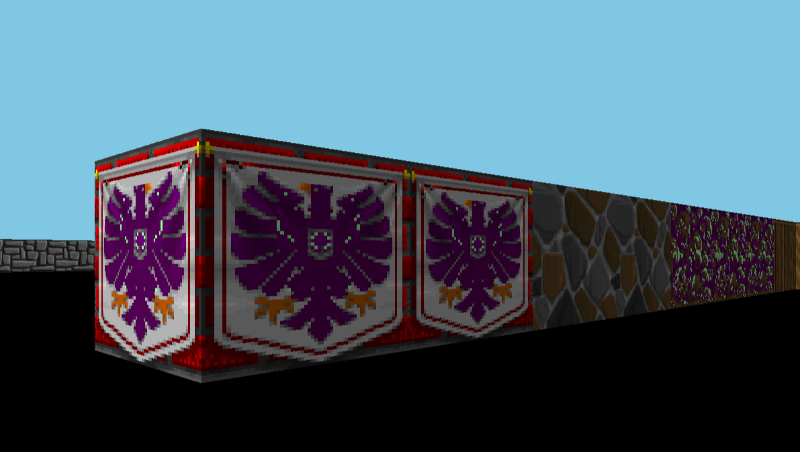
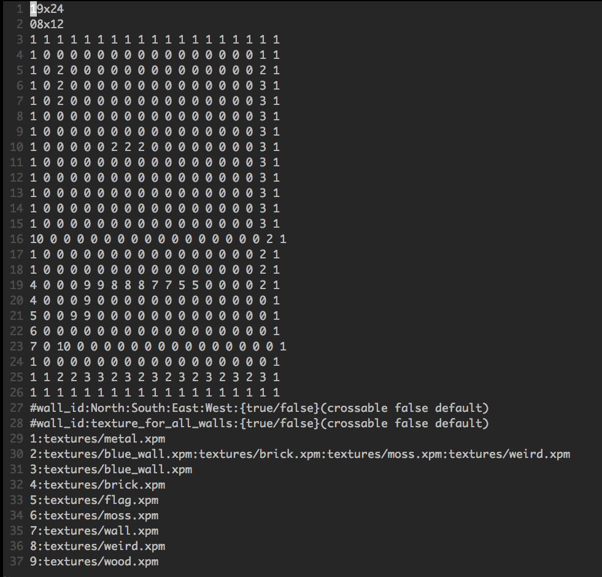
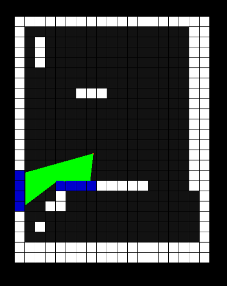

#Wolf3d

**Wolf3d** est un projet de la branche graphique de l'école 42. Le but de celui ci est de créer un jeu sur le modèle de **Wolfenstein 3D** (un jeu des années 90). Pour cela, j'ai implémenté une méthode de calcul d'image appelé **raycasting**. 

##Le rendu

Le raycasting est une méthode de rendu rapide, il permet de d'avoir un jeu fluide bien que les calculs ne soient effectués sur le CPU.

	

##Le parsing

Le chemin vers la carte doit être passée en **paramètre au lancement du programme**.

La carte doit être formatée ainsi:

* **longueur** x **largeur**, la taille maximale est de 100 x 100.
* Coordonnées du spawn.
* Carte, avec des blocs allant de 0 à 255, le 0 est réservé par le vide.
* Propriétés des blocs, il est possible de définir une texture unique ou une pour chaque point cardinal (les textures doivent être au format xpm).

	

##Bonus

J'ai prévu de réaliser plusieurs bonus dont voici la liste:

* Affichage de la carte.
* Textures du sol et du plafond. *en cours*
* Objets (sprites). *à venir*
* Interface et menus. *à venir*
* Client-Serveur, architecture **eer-to-peer** ou **two-tier**. *à venir*

	

